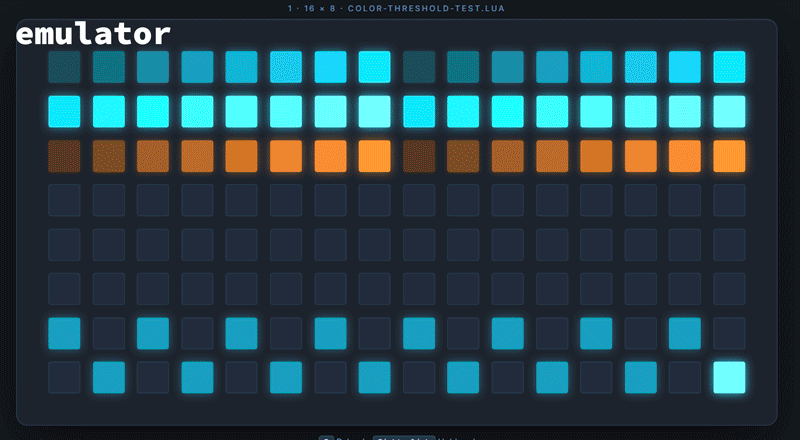

# diii-neotrellis-emulator

A browser-based emulator for loading Lua scripts designed for Monome and NeoTrellis grids. This project was born from my first tests of making an interactive manual for my serpentine script. I soon started implementing sound and thought i might as well build a full webapp to also emulate other scripts.

This is a vibecoded project, but none the less I have spent many hours building this and learning about the eco system.

I have a few diy projects from okyeron,  and it was through that discord server that I got intruiged by the new diii possibilities.

I built my own version of the firmware looking to create compatibility with og monome grid. I do not own any original monome geaar unfortunately.

I also hope I'm not breaking any licensing things, if so please let me know. I thought it be best if I also shared under the gpl license.

## Scripting & Hardware Compatibility


*Recording of `color_fallback_demo.lua` on NeoTrellis hardware, showing the device after using viii for the monochrome version of the test and then toggling pixels on the device.*


*Recording of `color_fallback_demo.lua` on NeoTrellis hardware, showing the fallback test running on device with interactive pixel toggling.*

I wrote a quick [readme guide](https://github.com/jonwaterschoot/diii-neotrellis-emulator/blob/main/uf2s/readme.md)in the uf2s directory with some quick tips to get the custom firmware for pico neotrellis up and running.

The emulator supports scripts written for both the original **Monome Grid** (monochrome) and the **Adafruit NeoTrellis** (RGB). To ensure your scripts are portable across different hardware targets, the following compatibility patterns are recommended.

### Monochrome Fallback Implementation

When developing for RGB grids, it is best practice to include a fallback for monochrome devices. This allows your script to run on standard Monome hardware without modification.

#### 1. Feature Detection
Use the presence of `grid_led_rgb` to determine if the hardware supports per-pixel color.

```lua
if grid_led_rgb then
    -- RGB Hardware logic
    grid_led_rgb(x, y, 255, 120, 0) -- Orange
else
    -- Monochrome Fallback logic
    grid_led(x, y, 15) -- Full Brightness
end
```

#### 2. Global Tinting vs. Per-Pixel Color
When firmware supports it, `grid_color(r, g, b)` sets a global tint for subsequent `grid_led()` / `grid_led_all()` output. This is useful when you want a single color theme across the grid without per-pixel overrides.

- `grid_color(r, g, b)`: Sets the global tint for `grid_led()` and `grid_led_all()` output.
- `grid_led_rgb(x, y, r, g, b)`: Sets true per-pixel RGB color.
- `grid_color_intensity(level)`: Sets a master brightness multiplier for the rendered output.

In practice, use `grid_color()` for tinted monochrome-style modes, and `grid_led_rgb()` when you need independent colors on the same grid.

#### 3. Graceful Degradation
Scripts like `monochrome_fallback.lua` demonstrate how to handle state transitions:
- **Rainbow/Color Modes**: active only if `grid_led_rgb` is available.
- **Intensity Modes**: fallback to `grid_led(x, y, 0-15)` when color is unavailable.
- **Auto-Initialization**: Detect hardware on script load to set default animation modes.

```lua
-- Example from monochrome_fallback.lua
if not grid_led_rgb then 
    anim_mode = 1 -- Force Monochrome mode
    palette_rgb = false 
end
```

## Hardware Limitations & Color Accuracy

### NeoTrellis Color Rendering Issues

**Low Brightness Color Shift**: At brightness levels 4-7, NeoTrellis LEDs exhibit inconsistent color rendering where cyan/blue tints may appear orange or reddish. This is due to physical LED characteristics and PWM limitations at low duty cycles.

**Confirmed Thresholds** (based on hardware testing):
- **Level 1-2**: Physically invisible on tinted `grid_led()` calls
- **Level 3**: First visible level on tinted `grid_led()` calls, but colors may be inaccurate
- **Level 4-7**: Visible but cyan/blue tints often render as orange/reddish
- **Level 8+**: Generally accurate color reproduction
- **RGB overrides**: `grid_led_rgb()` provides better color accuracy even at low brightness levels

**Testing Results**: Using `color-threshold-test.lua` on NeoTrellis hardware shows that tinted `grid_led()` calls become invisible at levels 1-2 and show color shifts at levels 3-7, while `grid_led_rgb()` calls maintain better color fidelity throughout the range.



*Systematic testing of color accuracy across brightness levels. Left side: tinted grid_led() calls (may shift on hardware). Right side: RGB overrides (maintains color accuracy).*

**Cross-Platform Testing**: Test scripts in both diii (color) and viii (monochrome) webapps:
- **diii app**: Shows full color rendering with RGB overrides
- **viii app**: Shows monochrome fallback (ignores RGB calls, shows only grid_led calls as white)

**Testing Script**: Use `scripts/colorfallback/color-threshold-test.lua` to identify exact color accuracy thresholds on your specific hardware.

**Workaround Demo**: `scripts/colorfallback/color-workaround-demo.lua` shows how to use `grid_led_rgb()` overrides for accurate low-brightness colors.

**Recommendations**:
- For reliable color reproduction, use brightness levels 8-15
- At lower levels, consider using monochrome mode or RGB overrides instead of tinted `grid_led()`
- Test your scripts on actual hardware, as the emulator may not perfectly replicate these physical limitations

## Available Scripts

- `serpentine_dev.lua`: A sophisticated snake-style sequencer with arpeggio support.
- `monochrome_fallback.lua`: A reference implementation for cross-hardware compatibility.
- `power_test.lua`: Diagnostic tool for grid power management.
- `test-grid-color.lua`: Comprehensive color compatibility test (global tints, RGB overrides, monochrome fallback).
- `color-threshold-test.lua`: Tests color accuracy at different brightness levels to identify hardware limitations.
- `color-workaround-demo.lua`: Demonstrates workarounds for NeoTrellis color accuracy issues at low brightness.

As okyeron started sharing news of the diii build for pico, i started trying to make a script that uses color.  
I forked his repo and started implementing this into this fork branch [feature/colors](https://github.com/jonwaterschoot/neotrellis-monome/tree/feature/colors/neotrellis_monome_picosdk_iii)

> Neotrellis repo by okyeron: https://github.com/okyeron/neotrellis-monome :
> 
> Code to use a set of Adafruit NeoTrellis boards as a monome grid clone using an off-the-shelf microcontroller.

> [!IMPORTANT]  
> I am not a C++ developer, and have made heavy use of **vibecoding** using Claude, Gemini in as plugins in VSCode and Google Antigravity to get this working.

I actually first started making a webpage to make a manual for my serpentines script, as it became close to a working version of the script i decided to try and make a emulator for it, so that i could keep my documentation up to date with my script.

So far my goal is to make an emulator that can be used as a manual guide for my scripts, and to make it easier to develop and test them.  


I have put my uf2 files in the `uf2s/` directory. in that directory also: a copy of the readme's that were created while building the neotrellis compatible firmware for the diii.  

> [!NOTE]
> **Nuke uf2** tool - Done some stupid thing like making a device crashing luascript the default to load on start? Bricking you out of using the webapp diii? Asking for friend 😉
> [You'll need to nuke the Flash](https://github.com/Gadgetoid/pico-universal-flash-nuke/releases)

## Official diii pages:

- Webapp to upload lua files: https://monome.org/diii/ 
    - Repo: https://github.com/monome/web-diii

- Docs: https://monome.org/docs/iii/

- Post on the monome forum about the release of iii by tehn (Brian Crabtree):
https://llllllll.co/t/iii/74311

    - Scripts shared by tehn on the forum:    
        - [meadowphysics](https://monome.org/docs/iii/library/mp/) (full version, basically identical to the module )
        - [intervals](https://monome.org/docs/iii/library/intervals) (a MIDI key map with linnstrument-like indication)
        - [wake](https://monome.org/docs/iii/library/wake) (another polymodulated awake-style sequencer with an interesting scale builder)

Okyeron's neotrellis repo: https://github.com/okyeron/neotrellis-monome


## My scripts

- [serpentineseqr dev](https://github.com/jonwaterschoot/diii-neotrellis-emulator/blob/main/scripts/serpentineseqr_dev.lua) - a snake game with color support for a 128 grid - my main reason to build this seq, and my main focus before i started building this emulator.  
Its still not working as I envisioned it, but its getting there.  

- [monochrome fallback test](https://github.com/jonwaterschoot/diii-neotrellis-emulator/blob/main/scripts/monochrome_fallback.lua) - as i needed to test if the monochrome fallback was working

- [power test](https://github.com/jonwaterschoot/diii-neotrellis-emulator/blob/main/scripts/power_test.lua) - as i needed to test if the power wasnt causing brownouts

> [!NOTE]  
> It is my intention to try and make my scripts backwards compatible with a standard monome grid, so that they can be run on both a standard monome grid and a neotrellis grid.  
> This is why i have included the `monochrome_fallback.lua` script. And i'm trying to use if grid.type == "neotrellis" to check for the grid type.

## Features

- **Grid Emulation**: Simulate monome and neotrellis grids with interactive buttons.
- **Lua Script Execution**: Run Lua scripts directly in the browser.
- **Real-time Feedback**: See button presses and grid state updates in real-time.
- **Multiple Grid Support**: Supports both standard monome grids and 16x16 neotrellis grids.

## Getting Started

### Prerequisites

- A modern web browser (Chrome, Firefox, Safari, Edge).
- [Node.js](https://nodejs.org/) (for running the development server).

### Installation

1.  Clone the repository:
    ```bash
    git clone <repository-url>
    cd diii-neotrellis-emulator
    ```

2.  Install dependencies:
    ```bash
    npm install
    ```

### Usage

1.  Start the development server:
    ```bash
    npm start
    ```

2.  Open your browser and navigate to `http://localhost:3141`.

3.  Select a Lua script to load and interact with the grid.

## Development

### Adding New Scripts

To add a new Lua script, simply place it in the `scripts/` directory. The script will be automatically loaded by the emulator.

### Development Server

The development server includes hot-reload, so any changes to the Lua scripts or the emulator code will be reflected immediately in the browser.

## Deployment (GitHub Pages)

This project is compatible with GitHub Pages. To host it yourself:

1.  Go to your repository **Settings** > **Pages**.
2.  Under **Build and deployment**, set **Source** to `Deploy from a branch`.
3.  Select the `main` branch and the `/ (root)` folder, then click **Save**.
4.  Your emulator will be available at `https://<your-username>.github.io/diii-neotrellis-emulator/`.

> [!TIP]
> The application uses relative paths, so it will work correctly even in a repository subfolder.

## License

This project is currently under research regarding the various licenses that may apply to the third-party components and resources it integrates.

For the original work contained within this repository, I have chosen the **GPL-3.0 License**. It is my personal intention to freely share anything I've made with the community.

